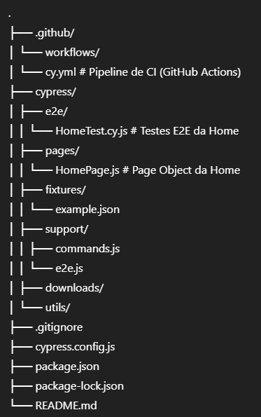

# Automated Tests with Cypress – Ravi Portfolio

This repository contains automated **End-to-End (E2E)** tests developed with **Cypress** to validate the behavior of Ravi Silva’s web portfolio.

The goal of this project is to demonstrate best practices in test automation, code organization, usage of Page Objects, Continuous Integration (CI), and a professional Pull Request workflow, following standards commonly used in corporate environments.

---

## 🧪 Technologies Used

- **JavaScript**
- **Cypress** (E2E Testing)
- **Node.js**
- **GitHub Actions** (CI)
- **GitHub Pages** (tested application)

---

## 📂 Project Structure

---

## 🧱 Architecture Pattern

The project follows the **Page Object Model (POM)** pattern:

- **Pages**: encapsulate UI selectors and actions  
- **Tests (e2e)**: focus only on behavior and validation  
- **Clear separation** between test logic and page structure  

This ensures:
- Better maintainability  
- More readable tests  
- Lower coupling  

---

## ▶️ Running Tests Locally

### Prerequisites
- Node.js **v18+**
- npm

### Install dependencies
npm install

### Open Cypress (interactive mode)
npm run cy:open

### Run tests in headless mode
npm test

### Other available commands
npm run cy:run  
npm run cy:run:headed  
npm run cy:run:chrome  
npm run cy:run:edge  

---

### 🤖 Continuous Integration (CI)
This project uses GitHub Actions to run tests automatically.

- The pipeline is triggered when:
There is a push to develop, master, or main  
A Pull Request is opened targeting develop, master, or main  
Manual execution via workflow_dispatch  

- What CI does:
Installs dependencies  
Runs Cypress tests in headless mode  
Blocks merges if tests fail  

---

### Pipeline file:
.github/workflows/cy.yml

---

### 🔀 Branch Flow
Flow inspired by corporate environments:
master  
  ↑  
develop  
  ├── feature/*  
  ├── fix/*  
  ├── docs/*  
  └── chore/*  

---

### Flow Rules
- Never develop directly on develop or master  
- Every change must be made in a specific branch  
- Every branch must be integrated via Pull Request  
- Branches are removed after merge  

---

### 📌 Pull Request Standard
Pull Request title  
Format:  
<type>(scope): short description  

ci(workflow): run Cypress E2E on pull requests  
fix(home): adjust contact form validation  
docs(readme): add project documentation  

---

### Pull Request Description Structure

- Summary  
Brief explanation of the change objective  

- Changes  
Objective list of implemented changes  

- How to Test  
Steps to validate the functionality  

- Notes  
Additional notes or technical impact  

---

### 🏷️ Versioning
Versions are generated from the master branch, following Semantic Versioning:
- v1.0.0 – first stable version  
- v1.1.0 – new features  
- v1.0.1 – bug fixes  

Tags are created only after full validation in the develop branch.

---

### 🎯 Project Goal
This project focuses on:
- QA best practices  
- Realistic E2E automation  
- Code organization and standardization  
- Continuous Integration applied in practice  
- Simulation of a professional development workflow  

---

### 👤 Author
Ravi Silva
