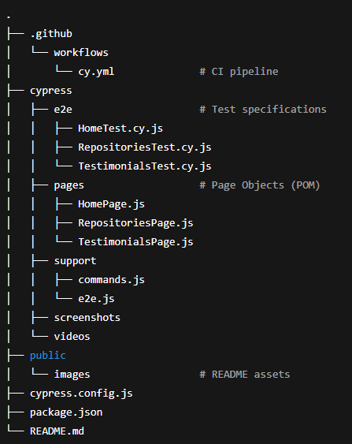

# Automated Tests with Cypress – Ravi Portfolio

This repository contains **End-to-End (E2E)** automated tests built with **Cypress** to validate the behavior, stability, and user flows of Ravi Silva’s Portfolio Website, hosted on GitHub Pages.

The project was designed to simulate real-world QA practices, following patterns, workflows, and standards commonly used in professional software teams.

---

## 🎯 Project Objectives

- Validate critical user journeys across the portfolio
- Demonstrate solid QA automation architecture
- Apply Page Object Model (POM) in practice
- Use resilient selectors suitable for real production environments
- Implement CI pipelines for automated validation
- Simulate a corporate Git workflow (branches, PRs, CI gates)

---

## 🧪 Technologies Used

- **JavaScript** (ES6+)
- **Cypress** (E2E Testing Framework)
- **Node.js**(v18+)
- **GitHub Actions** (CI - Continuous Integration)
- **GitHub Pages** (Target application under test)

---

## 📂 Project Structure

📌 Key principle:
- Tests focus on behavior, Page Objects encapsulate structure and actions.

---

## 🧱 Architecture – Page Object Model (POM)

The project follows the **Page Object Model (POM)** pattern:

- **Pages**: encapsulate UI selectors and actions  
- **Tests (e2e)**: focus only on behavior and validation  
- **Clear separation** between test logic and page structure  

Benefits:
- High maintainability
- Reduced duplication
- Easier refactoring
- Clear separation of concerns

---

## 🧪 Test Coverage Overview

🏠 Home Page:
- Page load & title validation
- Navbar navigation (Home, Repositories, Testimonials)
- Language switch and <html lang> validation
- Theme toggle (UI state comparison)
- Contact modal behavior
- HTML5 form validation
- External links domain validation (LinkedIn, GitHub, WhatsApp)

📦 Repositories Page:
- Page rendering validation
- Accordion interaction
- Repository cards rendering
- Validation of GitHub links

💬 Testimonials Page:
- Page access & rendering
- Testimonials card listing
- Modal open/close behavior
- Sorting (Oldest / Most recent)
- Pagination navigation
- Results per page validation (6 and 12 items)
- External LinkedIn profile validation

---

## ▶️ Running Tests Locally

### Prerequisites
- Node.js **v18+**
- npm

### Install dependencies
npm install

### Open Cypress (interactive mode)
npm run cy:open

### Run tests in headless mode
npm test

### Other available commands
npm run cy:run  
npm run cy:run:headed  
npm run cy:run:chrome  
npm run cy:run:edge  

---

### 🤖 Continuous Integration (CI)
This project uses GitHub Actions to automatically run Cypress tests.

Pipeline behavior:
(Triggered on)
- Push to main, master, or develop
- Pull Requests targeting those branches
- Manual execution (workflow_dispatch)

Steps:
- Install dependencies
- Run Cypress tests in headless mode
- Fail the pipeline if any test fails

---

### Pipeline file:
.github/workflows/cy.yml

---

### 🔀 Branch Flow
Flow inspired by corporate environments:
master  
  ↑  
develop  
  ├── feature/*  -> New functionality
  ├── test/*  -> Creating or improving tests
  ├── fix/*  -> Bug fix
  ├── docs/*  -> Documentation
  ├── chore/*  -> Configuration, CI, dependencies
  └── refactor/*  -> Refactoring without changing behavior

Rules:
- No direct commits to develop or master
- All changes via Pull Requests
- CI must pass before merge
- Branches removed after merge

---

### Flow Rules
- Never develop directly on develop or master  
- Every change must be made in a specific branch  
- Every branch must be integrated via Pull Request  
- Branches are removed after merge  

---

### 📌 Pull Request Standard
Pull Request title  
Format:  
<type>(scope): short description  

Examples:
- ci(workflow): run Cypress E2E on pull requests  
- fix(home): adjust contact form validation  
- docs(readme): add project documentation  

---

### Pull Request Description Structure

- Summary  
Brief explanation of the change objective  

- Changes  
Objective list of implemented changes  

- How to Test  
Steps to validate the functionality  

- Notes  
Additional notes or technical impact  

---

### 🏷️ Versioning
Versions are generated from the master branch, following Semantic Versioning:
- v1.0.0 – first stable version  
- v1.1.0 – new features  
- v1.0.1 – bug fixes  

Tags are created only after full validation in the develop branch.

---

### 👤 Author
Ravi Silva